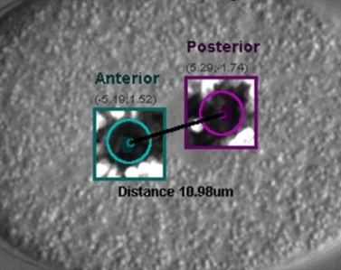

Automated Tracking of Centrosomes
===

Publication
--

**Automated high-throughput quantification of mitotic spindle positioning from DIC
movies of Caenorhabditis embryos.**

Cluet D(1), Stébé PN(1), Riche S(1), Spichty M(1), Delattre M(1).

[*PLoS One. 2014 Apr 24;9(4):e93718. doi: 10.1371/journal.pone.0093718. eCollection 2014.*](http://journals.plos.org/plosone/article?id=10.1371/journal.pone.0093718)

Author information:

(1)Laboratory of Molecular Biology of the Cell, Ecole Normale Supérieure de Lyon,
Centre National de la Recherche Scientifique, Lyon, France.

>**Abstract**: The mitotic spindle is a microtubule-based structure that elongates to accurately
segregate chromosomes during anaphase. Its position within the cell also dictates
the future cell cleavage plan, thereby determining daughter cell orientation
within a tissue or cell fate adoption for polarized cells. Therefore, the mitotic
spindle ensures at the same time proper cell division and developmental
precision. Consequently, spindle dynamics is the matter of intensive research.
Among the different cellular models that have been explored, the one-cell stage
C. elegans embryo has been an essential and powerful system to dissect the
molecular and biophysical basis of spindle elongation and positioning. Indeed, in
this large and transparent cell, spindle poles (or centrosomes) can be easily
detected from simple DIC microscopy by human eyes. To perform quantitative and
high-throughput analysis of spindle motion, we developed a computer program ACT
for Automated-Centrosome-Tracking from DIC movies of C. elegans embryos. We
therefore offer an alternative to the image acquisition and processing of
transgenic lines expressing fluorescent spindle markers. Consequently,
experiments on large sets of cells can be performed with a simple setup using
inexpensive microscopes. Moreover, analysis of any mutant or wild-type
backgrounds is accessible because laborious rounds of crosses with transgenic
lines become unnecessary. Last, our program allows spindle detection in other
nematode species, offering the same quality of DIC images but for which
techniques of transgenesis are not accessible. Thus, our program also opens the
way towards a quantitative evolutionary approach of spindle dynamics. Overall,
our computer program is a unique macro for the image- and movie-processing
platform ImageJ. It is user-friendly and freely available under an open-source
licence. ACT allows batch-wise analysis of large sets of mitosis events. Within 2
minutes, a single movie is processed and the accuracy of the automated tracking
matches the precision of the human eye.

DOI: 10.1371/journal.pone.0093718

PMCID: PMC3998942

PMID: 24763198  [Indexed for MEDLINE]

Authors
--
|    | |
-----------------------------|------------|
**CLUET David**|     [david.cluet@ens-lyon.fr](david.cluet@ens-lyon.fr)
**SPICHTY Martin**|  [spichty.martin@ens-lyon.fr](david.cluet@ens-lyon.fr)
**DELATTRE Marie**|  [marie.delattre@ens-lyon.fr](david.cluet@ens-lyon.fr)

License
--

Copyright CNRS 2013

>This software is a computer program whose purpose is to automatically track
centrosomes in DIC movies.
>
>This software is governed by the CeCILL  license under French law and abiding
by the rules of distribution of free software. You can use, modify and/ or
redistribute the software under the terms of the CeCILL license as circulated
by CEA, CNRS and INRIA at the following URL:
http://www.cecill.info/index.en.html
>
>As a counterpart to the access to the source code and  rights to copy, modify
and redistribute granted by the license, users are provided only with a limited
warranty  and the software's author,the holder of the economic rights, and the
successive licensors have only limited liability.
>
>In this respect, the user's attention is drawn to the risks associated with
loading, using, modifying and/or developing or reproducing the software by the
user in light of its specific status of free software, that may mean  that it
is complicated to manipulate, and that also therefore means  that it is
reserved for developers  and  experienced professionals having in-depth
computer knowledge. Users are therefore encouraged to load and test the
software's suitability as regards their requirements in conditions enabling
the security of their systems and/or data to be ensured and, more generally,
to use and operate it in the same conditions as regards security.
>
>The fact that you are presently reading this means that you have had knowledge
of the CeCILL license and that you accept its terms.

Requirements
--
* The **ACT** macro requires `ImageJ v1.47s` or higher ([Download](https://imagej.nih.gov/ij/download.html)).
* The `.mov` files require the `Quicktime plugin` for ImageJ ([Download](https://imagej.nih.gov/ij/plugins/movie-opener.html)) 

Files
--
- [] **ACT**
    - README.md
    - LICENSE.txt
    - [] **doc**
        - *ACT_analysis.jpg*
        - *Logo_cnrs.jpg*
        - *Logo_ens.jpg*
        - *Logo_LBMC.jpg*
    - [] **src**
        - `Installation.ijm`
        - `Installation_FIJI.ijm`
        - [] **Macro**
            - `ACT_Motor_CommandLine.ijm`
            - `ACT_Table_CommandLine_creation.ijm`
            - `ACT.jpg`
            - `CMD_SUM.ijm`

Installation procedure
--
By default your `ImageJ` program has no shortcut to the **ACT macro**. The objective of this installation procedure is to transfer automatically the **ACT macro** and all its required files within `ImageJ/Macros` sub-folder.
 Finally, for convenient usage, shortcuts will be automatically generated within
the Plugins/Macros menu. If you have already a version of **ACT**, the installation procedure will overwrite it, making easy updating of your system.

The following procedure is described in our on-line [installation tutorial video](http://www.ens-lyon.fr/LBMC/fichiers/equipe-spichty/actinstallation.mp4):

1. First launch the `ImageJ` program.
2. Open the folder you downloaded from our web site. It contains the current
version of the **ACT** macro and the `Installation.ijm` file. Drag this file and drop it on `ImageJ` command bar (If you are currently working on `FIJI` please use the `Installation_FIJI.ijm` file). A new window will automatically pop up.
3. Use in the menu bar the `Macros/Run Macro` command.
4. The previous window disappears and `License agreement` window of the installation program is displayed. `Check` the license agreement box. `Click` on `OK` to proceed with the installation.
5. The installation is then performed in few seconds. At the end of the process the program inform you of the success of the installation.
6. Quit `ImageJ` to update the `startup macro file`  (If you perform an updating of ACT, you can already use it without restarting
ImageJ).
7. Once `ImageJ` is restarted you can see two new shortcuts in the `Plugin/Macros`
menu:
    - **A.C.T.**
    - **A.C.T. Command-Lines LAUNCHER**

For further informations concerning the program please refer to the *ACT_User_Guide_CeCILL_2014-02-28.pdf* file or to our on-line:
- [tracking tutorial video](http://www.ens-lyon.fr/LBMC/fichiers/equipe-spichty/acttutorial.mp4).
- pdf [user guide](http://www.ens-lyon.fr/LBMC/fichiers/equipe-spichty/act-user-guide-cecill-2014-02-28.pdf).
